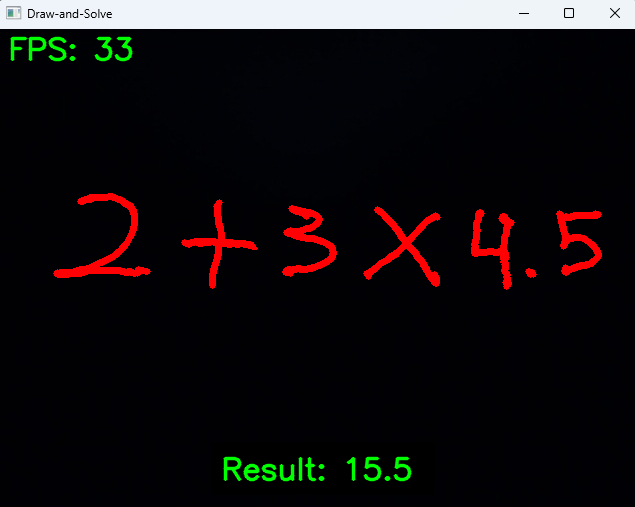

# Draw-and-Solve: A Real-Time Virtual Handwritten Math Expression Recognition and Evaluation System


**A Real-Time Computer Vision System for Handwritten Math Expression Recognition and Evaluation.**

## Project Overview

Draw-and-Solve is an interactive computer vision application that transforms a webcam into a virtual whiteboard. Users
can write mathematical equations in mid-air using hand gestures. The system tracks fingertips in real-time, renders the
drawing on screen, uses Optical Character Recognition (OCR) to interpret the math, and solves it instantly.

This project demonstrates the integration of gesture recognition, digital image processing, and machine learning-based
OCR into a cohesive real-time application.

*Figure 1: Real-time demonstration of the system detecting digits and solving the equation.*

---

## Key Features

* **Air Canvas:** Draw naturally in mid-air using index finger tracking.
* **Intelligent OCR:** Utilizes EasyOCR (with optional GPU acceleration) to recognize handwritten digits and operators.
* **Real-Time Solving:** Parses and evaluates mathematical expressions safely using SymPy.
* **Gesture Controls:** Intuitive hand gestures to toggle between Drawing, Pausing, and Erasing modes.
* **Modular Architecture:** Clean, separated code structure using Model-View-Controller principles for maintainability.

---

## Tech Stack

* **Language:** Python 3.x
* **Computer Vision:** OpenCV, MediaPipe
* **Deep Learning / OCR:** EasyOCR, PyTorch
* **Mathematics:** SymPy, NumPy

---

## Project Structure

```text
Draw-and-Solve/
│
├── src/
│   ├── __init__.py
│   ├── config.py          # Configuration (Colors, ROI, Camera Settings)
│   ├── hand_setup.py      # MediaPipe Hand Tracking Logic
│   └── math_utils.py      # OCR and Math Evaluation Logic
│
├── main.py                # Entry point of the application
├── requirements.txt       # Project dependencies
├── LICENSE                # MIT License
└── README.md              # Project Documentation
```

---

## Installation & Setup

### 1. Clone the Repository

```bash
git clone [https://github.com/jannskiee/Draw-and-Solve.git](https://github.com/jannskiee/Draw-and-Solve.git)
cd Draw-and-Solve

```

### 2. Create a Virtual Environment (Recommended)

It is best practice to run this project in a virtual environment.

```bash
python -m venv venv
# Windows:
venv\Scripts\activate
# Mac/Linux:
source venv/bin/activate

```

### 3. Install Dependencies

```bash
pip install -r requirements.txt

```

**Note on PyTorch (GPU Support):**
If you have an NVIDIA GPU and want faster OCR performance, install the CUDA version of PyTorch separately:

```bash
pip3 install torch torchvision torchaudio --index-url [https://download.pytorch.org/whl/cu118](https://download.pytorch.org/whl/cu118)

```

---

## Usage Guide

Run the application using the following command:

```bash
python main.py

```

### Gesture Controls

The system uses specific finger configurations to control the canvas:

| Mode      | Gesture Description            | Visual Indicator      |
|-----------|--------------------------------|-----------------------|
| **DRAW**  | **Index Finger** Up            | Red Dot & Line        |
| **PAUSE** | **Index + Middle Fingers** Up  | Green "PAUSED" Text   |
| **ERASE** | **All Fingers** Up (Open Palm) | Black Circle (Eraser) |

### How to Use

1. **Draw:** Point your index finger to write numbers (e.g., "2 + 2").
2. **Wait:** Keep your hand steady or pause (two fingers up) to let the OCR process the image.
3. **Result:** The solution will appear at the bottom of the screen automatically (every ~1 second).
4. **Clear:** Show your open palm to erase the board and start over.
5. **Exit:** Press 'q' on your keyboard to close the application.

---

## Important Notes

* **Lighting:** Ensure the room is well-lit. Shadows or backlighting can interfere with hand tracking.
* **Background:** A plain background helps the OCR distinguish text more accurately.
* **Writing Speed:** Write clearly and at a moderate speed to prevent jagged lines.

---

## License

This project is licensed under the MIT License - see the LICENSE file for details.

---

## Author

**Jan Carlo Paredes**

* **GitHub:** [github.com/jannskiee](https://www.google.com/search?q=https://github.com/jannskiee)
* **LinkedIn:** [linkedin.com/in/yourprofile](https://linkedin.com/in/yourprofile)